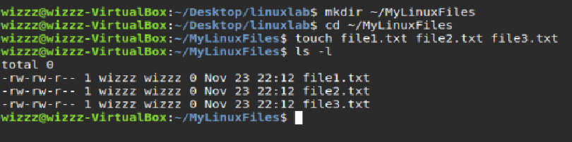
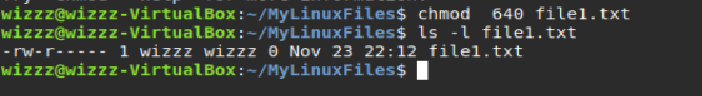
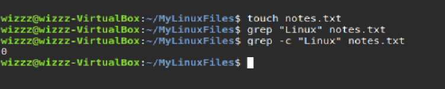
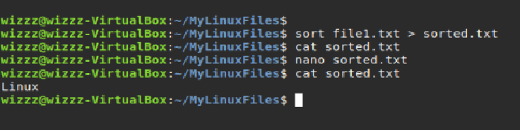
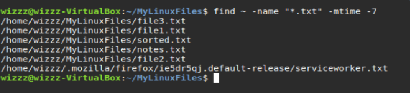
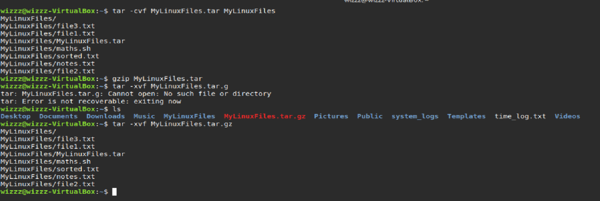
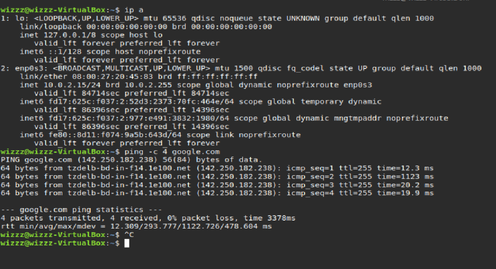
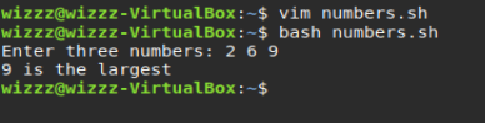
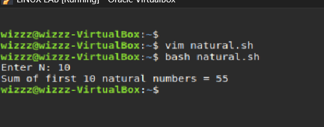

# Assignment-1: Linux Commands & Shell Scripting Report
**Name:** Priyadarshi Prabhakar 
**Roll No.:** 590029237
**Date:** 2025-09-23  
  
## Aim
To perform and demonstrate Linux file handling, permissions, text processing, redirection, search, archiving, networking, and shell scripting operations through 10 structured tasks.
  
## Requirements
- Linux system (Ubuntu/Linux Mint/Debian)
- Terminal access
- Text editor (nano/vim)
- Internet connection (for ping)
  
## Task 1: File and Directory Commands
### Commands
```
mkdir ~/MyLinuxFiles
cd ~/MyLinuxFiles
touch file1.txt file2.txt file3.txt
ls -l
```
### Output

  
## Task 2: File Permissions
### Commands
```
chmod 640 file1.txt
ls -l file1.txt
```
### Output

  
## Task 3: Text Processing
### Commands
```
grep "Linux" notes.txt
grep -c "Linux" notes.txt
```
### Output

  
## Task 4: Redirection and Pipes
### Commands
```
sort file1.txt > sorted.txt
cat sorted.txt
```
### Output

  
## Task 5: Shell Scripting – Arithmetic
### Script
```
#!/bin/bash
read -p "Enter first number: " a
read -p "Enter second number: " b
  
echo "Sum: $((a+b))"
echo "Difference: $((a-b))"
echo "Product: $((a*b))"
  
if [ $b -eq 0 ]; then
  echo "Error: Division by zero is not allowed"
else
  echo "Quotient: $((a/b))"
fi
```
### Output

  
## Task 6: File Searching
### Commands
```
find ~ -name "*.txt" -mtime -7
```
### Output

  
## Task 7: Archiving and Compression
### Commands
```
tar -cvf MyLinuxFiles.tar MyLinuxFiles
gzip MyLinuxFiles.tar
tar -xvf MyLinuxFiles.tar.gz
```
### Output

  
## Task 8: Networking
### Commands
```
ip a
ping -c 4 google.com
```
### Output

  
## Task 9: Largest of Three Numbers
### Script
```
#!/bin/bash
read -p "Enter three numbers: " a b c
  
if (( a>=b && a>=c )); then
  echo "$a is the largest"
elif (( b>=a && b>=c )); then
  echo "$b is the largest"
else
  echo "$c is the largest"
fi
```
### Output

  
## Task 10: Sum of First N Natural Numbers
### Script
```
#!/bin/bash
read -p "Enter N: " n
sum=0
  
for ((i=1; i<=n; i++)); do
  sum=$((sum+i))
done
  
echo "Sum of first $n natural numbers = $sum"
```
### Output

  
## Result
All 10 tasks of Assignment-1 were successfully executed.
  
## Conclusion
This assignment strengthened fundamental Linux skills and provided hands-on practice.
  