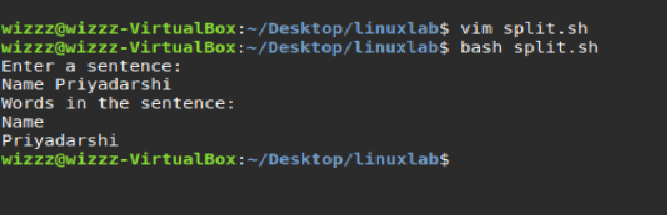

# Lab: Interacting with Users, Parsing Data & String Processing
### Name = Priyadarshi Prabhakar SAP ID 590029237
## **Theory**
### **Interacting with Users**
Interactive shell scripts allow users to input data during execution using commands like:
- `read` for capturing input  
- Prompt messages to guide user interaction  

### **Parsing and Processing Data Formats**
Shell scripts can process text data using:
- `cut`, `awk`, `sed`  
- String manipulation using bash parameter expansion  
- Loops and conditionals for text parsing  

### **Interacting with Databases**
Shell scripts can communicate with databases such as MySQL or PostgreSQL using:
- `mysql -u user -p -e "QUERY"`  
- `psql -c "QUERY"`  
Useful for automation, backups, and reporting.

---

## **Lab Tasks**

---

## **Task 1: Split a Sentence into Words**

### **Script:`**
```bash
#!/bin/bash

echo "Enter a sentence:"
read sentence

echo "Words in the sentence:"
for word in $sentence; do
    echo "$word"
done
```

---
## **OUTPUT**



## **Task 2: Check if a String is a Palindrome**

### **Script:`**
```bash
#!/bin/bash

echo "Enter a string:"
read str

cleaned=$(echo "$str" | tr -d ' ' | tr 'A-Z' 'a-z')

reversed=$(echo "$cleaned" | rev)

if [ "$cleaned" = "$reversed" ]; then
    echo "The string is a palindrome."
else
    echo "The string is NOT a palindrome."
fi
```

---
## **OUTPUT**


## **Summary**
This lab covered:
- Reading and processing user input in shell scripts  
- Splitting sentences using loops  
- Checking palindromes using text manipulation and `rev`  
- Understanding interactive scripting and data processing  

These exercises build foundational skills for automation, validation, and text parsing tasks in shell scripting.

---

**End of Document**
